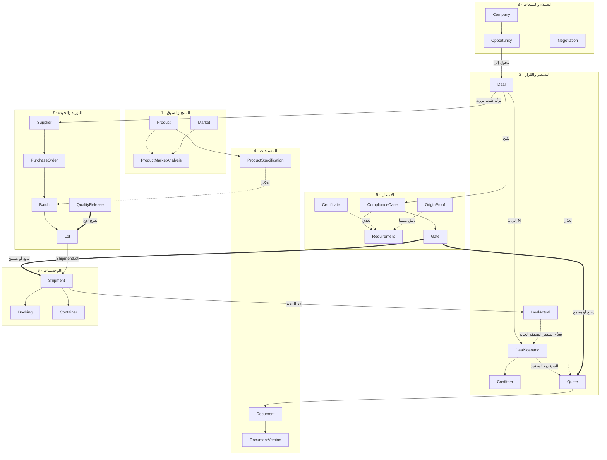

# مخطط العلاقات الموحّد — ERD v4

**الحالة:** ⚠️ توسّع معماري كبير (26 أغسطس 2026) — المنصة بقت 9 وحدات بدل 7 (+ الحسابات/الخزينة والحوكمة/RBAC). **محتاج قرار أولوية من صاحب المشروع قبل استكمال P2** — راجع §17.
**آخر تحديث:** 2026-08-26
**يحل محل:** ERD v3.1 (26 أغسطس 2026، نفس اليوم) — قائمة تغييرات v4 في القسم 16، وv3.1 وv2 وv1 في الأقسام 15 و14.
**المصدر:** التقرير النهائي + المواصفات السبعة (قراءة كاملة حقلًا بحقل) + [المراجعة النقدية ومستجدات 2026](REVIEW-2026-08.md) + مراجعة عميقة لكل مواصفة مقابل ERD v2 (25 أغسطس 2026) + مراجعة نهائية سطر بسطر قبل بدء P2 (26 أغسطس 2026، §15) + مراجعة معمارية شاملة وسّعت النطاق لمنصة مؤسسية كاملة (26 أغسطس 2026، §16).

---

## 0. ليه الملف ده قبل أي كود

كل الوحدات (السبع التصديرية الأصلية + وحدتا الحسابات والحوكمة المضافتان في v4) بتتشارك كيانات (المنتج، الصفقة، الشحنة، الحساب...). لو كل وحدة اخترعت شكلها الخاص لنفس الكيان، هنرجع لنفس العيب اللي رصدته المراجعة العكسية: «تكامل» شكلي عن طريق تصدير/استيراد JSON يدوي بدل بيانات حية مشتركة.

الملف ده هو العقد الملزم بين الوحدات. أي تغيير فيه بيتسجّل هنا الأول، مش في الكود مباشرة.

---

## 1. القواعد العامة على كل الكيانات

مش متكررة في الجداول تحت لتوفير المساحة — لكنها ملزمة على كل كيان.

### 1.1 الأعمدة التلقائية

| العمود | النوع | ملاحظة |
|---|---|---|
| `id` | `uuid` بقيمة افتراضية **`uuidv7()`** | دالة أصلية في PostgreSQL 18. مرتبة زمنيًا → فهرسة أسرع بكتير من `uuidv4()` العشوائي |
| `orgId` | `uuid` → Organization | على **كل** كيان تشغيلي. أساس كل RLS policy |
| `createdAt` / `updatedAt` | `timestamptz` | |
| `createdBy` | `uuid` → User | |
| `deletedAt` | `timestamptz` nullable | **أرشفة، مش حذف.** المواصفات بتقول «لا تحذف» عشرات المرات |

### 1.2 المبالغ المالية

أي مبلغ = عمودين منفصلين: `amount` (numeric) + `currency` (char(3) ISO 4217). ممنوع رقم وعملة مدموجين في نص.

أي مبلغ بيتقارن أو بيتجمّع عبر عملات مختلفة لازم يكون معاه `fxRateId` → ExchangeRate — سعر الصرف المستخدم وقت العملية، مش وقت العرض.

> ⚠️ **إنفاذ إلزامي (v4)**: `numeric` في القاعدة بيحل نص المشكلة بس — لازم كود التطبيق (محرك التسعير في وحدة 2، ومحركات الحسابات في وحدة 8) يستخدم مكتبة Decimal حقيقية (مش `Number`/float عادي في JavaScript) لأي عملية حسابية على مبالغ، وإلا فروق تقريب صغيرة بتتراكم عبر آلاف الصفوف وتكسر توازن `JournalEntry` (§11.1). وممنوع تمامًا أي `fxRateId` يكون فاضي/افتراضي (زي `1.0`) عند غياب سعر صرف فعلي — غياب السعر لازم يمنع الحفظ (`STOP`)، مش يفترض تعادل العملتين.

### 1.3 القيم المحسوبة = Virtual Generated Columns

PostgreSQL 18 بيدعم أعمدة محسوبة وقت الاستعلام. القيم دي **ممنوع تتخزن كأعمدة عادية** لأنها بتقع في خطر التضارب مع مصدرها:

| العمود | المعادلة |
|---|---|
| `Batch.yieldRate` | `quantityOutput / NULLIF(quantityInput, 0)` |
| `Batch.wasteQuantity` | `quantityInput - quantityOutput` |
| `DealScenario.quantitySaleable` | `quantityRaw * yieldRate` |
| `SupplierQuote.effectiveCostPerSaleableKg` | `totalEffectiveCost / NULLIF(expectedSaleableQty, 0)` |
| `Container.weightUtilization` | `grossWeight / NULLIF(maxPayload, 0)` |
| `CostItem.variance` | `actualAmount - amount` |
| `Shipment.aciDeadlineMet` 🆕v3 | `aciSubmittedAt IS NOT NULL AND etd IS NOT NULL AND aciSubmittedAt <= etd - interval '48 hours'` |

### 1.4 الأمان

- 🔒 = **مشفّر عموديًا** من أول Migration (IBAN, SWIFT, أسماء المستفيدين، أي بيانات هوية شخصية). ممنوع تصديرها كاملة إلا بصلاحية مالك الشركة.
- أي كيان فيه موافقة/اعتماد بيتحقق عبر **Row-Level Security** على مستوى القاعدة، مش شرط في الواجهة.
- كل RLS policy بتستخدم `(select auth.uid())` مش `auth.uid()` المباشرة، وكل عمود مستخدم جوه policy عليه **Index**.
- التعديل على أي سجل بعد اعتماده بينشئ **نسخة جديدة**، مش تعديل فوق المعتمد.

### 1.5 الكيانات المشتركة — قرار توحيد مقصود

المواصفات السبعة كررت نفس الفكرة في كل وحدة (كل وحدة عندها «مهام» و«موافقات» و«مصادر» و«إجراءات تصحيحية» بشكلها الخاص). ده كان جزء من سبب تضخّم الحجم. هنا موحّدين مرة واحدة:

`Task` · `Approval` · `ApprovalPolicy` · `Source` · `CAPA` · `Attachment` · `AuditLog` · `ExchangeRate` · `RegulatoryChange` · `Rate` 🆕v3 · `ScoreSnapshot` 🆕v3

---

## 2. خريطة مسار الصفقة

مش تفصيل حقول — ده **مسار البيانات الفعلي** عبر الوحدات، وفين نقاط المنع.

**الخط الرئيسي:** عميل → فرصة → صفقة → **سيناريوهات متعددة تتقارن** → عرض سعر ← *بوابة امتثال تقدر تمنعه* → أمر شراء → إنتاج → تعبئة ← *Quality Release لازم يفرج* ← *الامتثال لازم يقفل* → شحنة → **النتائج الفعلية ترجع تغذّي التسعير الجاي**.

الحلقة الأخيرة دي (DealActual → DealScenario) هي محرك التعلّم في المنظومة — وكانت مفقودة تمامًا في v1.

---

## 3. الطبقة المشتركة (Platform)

| الكيان | الحقول |
|---|---|
| **Organization** | `name`, `legalName`, `taxId`, `isActive` — صف واحد مزروع. موجود كتأمين معماري فقط، **بلا أي واجهة إدارة مستأجرين** |
| **User** | `fullName`, `email`, `role` enum(SalesRep, SalesManager, Finance, ComplianceOfficer, ProcurementOfficer, QualityManager, LogisticsOfficer, CompanyOwner, Admin), `isActive`, `mfaEnabled` |
| **AuditLog** ⚠️ Insert-only، جدول منفصل ماديًا، ممنوع UPDATE/DELETE حتى للـ Admin | `userId`, `action` (مثل `"quote.price_approved"`), `entityType`, `entityId`, `beforeValue` jsonb, `afterValue` jsonb, `ipAddress`, `occurredAt` |
| **Approval** | `subjectType` + `subjectId`, `policyId` → ApprovalPolicy, `requestedBy` → User, `decidedBy` → User, `decision` enum(Pending, Approved, Rejected, Escalated), `reason`, `decidedAt`, `expiresAt` |
| **ApprovalPolicy** | `subjectType`, `conditionField`, `operator` enum(GT, GTE, LT, LTE, EQ), `thresholdValue`, `requiredRole`, `escalationRole`, `isActive` — قابلة للتعديل من الإعدادات بلا كود |
| **ScoreSnapshot** 🆕v3 | يخزّن *سبب* أي درجة موزونة محسوبة في المنظومة (Customer Fit/Trust, Deal Score, Cost Confidence, Readiness Score, Logistics Score, Route Score...) — `subjectType`, `subjectId`, `scoreType` enum, `totalScore`, `componentsBreakdown` jsonb (كل مكوّن ووزنه وقيمته الفعلية وقت الحساب), `calculatedAt`, `calculatedBy` → User nullable (null = محسوبة آليًا). بدونه قاعدة «لا تُعطِ درجة بلا سبب» المتكررة في المواصفات الثلاث (2، 3، 6) غير قابلة للتحقق |
| **ExchangeRate** | `baseCurrency`, `quoteCurrency`, `rate`, `rateDate`, `rateType` enum(Spot, Budget, Contracted, Actual), `sourceId` → Source |
| **Rate** 🆕v3 | مكتبة أسعار موحّدة (بديل عن أسعار متفرقة بلا مصدر واحد) — `rateType` enum(SupplierPrice, PackagingPrice, InlandTransport, InternationalFreight, ServiceFee, MarketPrice), `providerName`, `productOrServiceRef`, `route`, `specification`, `currency`, `priceUnit`, `value`, `minQuantity`, `maxQuantity`, `applicableQuantity`, `validFrom`, `validUntil`, `sourceId` → Source, `isOfficial` bool, `isApproved` bool, `confidenceLevel` enum(VeryHigh, High, Medium, Low, Unverified). يُستخدم عبر `CostItem.rateId` لتفعيل Price Expiry Engine (§5) |
| **Task** | `title`, `relatedEntityType` + `relatedEntityId`, `assignedTo` → User, `dueDate`, `status` enum(NotStarted, InProgress, Blocked, Done, Cancelled), `priority` |
| **Source** | `sourceType` enum(Market, Regulatory, Supplier, Competitor, FxRate, Other), `title`, `url`, `authority`, `reliability` enum(VeryHigh, High, Medium, Low, Unverified), `publishedAt`, `accessedAt`, `nextReviewAt` |
| **RegulatoryChange** | `marketId` → Market, `changeType` enum(MRL, Label, Certificate, Tariff, Origin, DataProtection, CustomsProcedure), `effectiveDate`, `transitionEndDate`, `affectedHsCodes` text[], `affectedParameters` jsonb, `description`, `sourceId` → Source, `impactLevel` enum(Critical, High, Medium, Low, Informational) |
| **CAPA** | `rootCause`, `rootCauseMethod` enum(FiveWhys, Fishbone, Other), `correctiveAction`, `preventiveAction`, `ownerId` → User, `dueDate`, `verifiedBy` → User, `status` enum(Open, InProgress, VerificationPending, Effective, Ineffective, Closed, Overdue) |
| **Attachment** | `ownerType` + `ownerId`, `fileUrl`, `fileType`, `fileSizeBytes`, `confidentiality` enum(Public, Internal, Confidential, HighlyConfidential), `uploadedBy` → User |
| **IntegrationEvent** (Outbox) | `eventType`, `payload` jsonb, `occurredAt`, `processedAt`, `attempts`, `lastError` — يُستهلك عبر `pg_cron` أو Edge Function لضمان التسليم |
| **DataProcessingRecord** 🇪🇬 PDPL | `activityName`, `purpose`, `legalBasis`, `dataCategories` text[], `dataSubjectTypes` text[], `recipients` text[], `crossBorderTransfer` bool, `transferDestination`, `retentionPeriodMonths`, `securityMeasures` |
| **ConsentRecord** 🇪🇬 PDPL | `dataSubjectType` enum(Contact, SupplierContact, Employee), `dataSubjectId`, `purpose`, `legalBasis` enum(Consent, Contract, LegalObligation, LegitimateInterest), `consentGivenAt`, `withdrawnAt`, `evidenceId` → Attachment |

---

## 4. الوحدة 1 — المنتج والسوق

| الكيان | الحقول |
|---|---|
| **Product** | `nameAr`, `nameEn`, `scientificName`, `hsCode`, **`egsCode`** (كتالوج GS1/EGS — إلزامي للفاتورة الإلكترونية المصرية), `category`, `originCountry`, `harvestSeason`, `availableMonths` int[], `storageTempC`, `shelfLifeDays`, `requiresRefrigeration` bool, `status` enum(Draft, Verified, NeedsReview) |
| **Market** | `countryNameAr`, `countryNameEn`, `countryCode` (ISO 3166), `continent`, `currency`, `mainPorts` text[], `tradeAgreement`, `politicalRiskScore`, `logisticsRiskScore`, `lastReviewedAt` |
| **ProductMarketAnalysis** | `productId`, `marketId`, `year`, `opportunityScore`, `riskScore`, `confidenceLevel`, `recommendation` enum(Start, Study, Monitor, Avoid) |
| **Competitor** | `productId`, `marketId`, `countryName`, `strengthMonths` int[], `weaknessMonths` int[], `priceRangeMin`, `priceRangeMax`, `currency`, `sourceId` → Source |
| **MonthlyOpportunity** | `productId`, `marketId`, `month` (1–12), `opportunityScore`, `demandScore`, `competitionScore`, `logisticsRiskScore`, `recommendedAction` |
| **EntryPlan** | `productId`, `marketId`, `budget`, `currency`, `targetQuantity`, `status` enum(Draft, Active, Completed, Cancelled) — مهامه عبر `Task` |

---

## 5. الوحدة 2 — التسعير والقرار

> **أهم تغيير في v2:** `Deal` اتفصل عن `DealScenario`. الصفقة هي الهوية التجارية الثابتة؛ السيناريو هو كل الأرقام. من غير الفصل ده، مقارنة السيناريوهات (الميزة الأساسية للوحدة) مستحيلة.

| الكيان | الحقول |
|---|---|
| **Deal** | `opportunityId` → Opportunity, `productId`, `marketId`, `customerId` → Company, `dealObjective` enum(MaximizeProfit, NewMarketEntry, WinCustomer, ProtectAccount, ClearInventory, TestMarket), `status` enum(Draft, Pricing, Negotiation, Approved, Won, Lost, Cancelled), `activeScenarioId` → DealScenario, `lostReason` |
| **DealScenario** | `dealId`, `version`, `scenarioName` (Current / BestCase / WorstCase / AltSupplier / AltIncoterm / AltPayment...), `quantityRaw`, `yieldRate`, `quantitySaleable` ⚙️, `incoterm` enum(EXW,FCA,FAS,FOB,CFR,CIF,CPT,CIP,DAP,DPU,DDP), `namedPlace`, `paymentTerms`, `advanceRatePct`, `creditDays`, `currency`, `fxRateId` → ExchangeRate, `breakEvenPrice`, `walkAwayPrice`, `targetPrice`, `openingPrice`, `finalPrice`, `expectedProfit`, `expectedMarginPct`, `expectedMarkupPct`, `financeCost`, `riskReserve`, `dealScore`, `costConfidenceScore`, `isLocked` bool |
| **CostItem** | **`scenarioId`** → DealScenario, `category` enum(Product, Processing, Packaging, Quality, ExportLogistics, InternationalFreight, DestinationCharges, SellingAdmin, Finance, RiskReserve), `subcategory`, `incotermStage`, `amount`, `currency`, `fxRateId`, **`rateId`** → Rate nullable 🆕v3, `allocationMethod`, `quantityDriver`, `confidenceLevel` enum(Contract100, OfficialQuote90, ExpiringQuote75, HistoricalAvg60, InternalEstimate40, Assumption20), `expiryDate`, **`actualAmount`** nullable, `variance` ⚙️, `sourceId` → Source |
| **RiskItem** | **`scenarioId`**, `riskType` enum(FX, Freight, Supplier, Quality, Credit, Compliance, Weather, Political), `probability` (0–1), `financialImpact`, `expectedCost` ⚙️ (`probability × financialImpact`), `mitigation`, `residualRisk` |
| **Quote** | `dealId`, `scenarioId` (السيناريو المعتمد), `version`, `customerId`, `currency`, `incoterm`, `namedPlace`, `validUntil`, `status` enum(Draft, PendingApproval, Sent, Accepted, Rejected, Expired, Superseded), `approvalId` → Approval, `documentId` → Document — البند الوحيد (`unitPrice`/`priceUnit`) بقى عبر `QuoteLine` 🆕v4 لدعم عرض سعر متعدد المنتجات في نفس الحاوية/الشحنة |
| **QuoteLine** 🆕v4 | `quoteId` → Quote, `productId` → Product, `quantity`, `unitPrice`, `priceUnit`, `currency` — بدونه Quote كانت مقيّدة بمنتج واحد فقط، رغم إن شحنة واحدة (حاوية Herbs & Spices مثلًا) بتضم منتجات متعددة فعليًا في الممارسة التجارية |
| **SalesOrder** 🆕v4 | `dealId`, `customerId` → Company, `soNumber` (فريد)، `poNumber` (رقم أمر الشراء الوارد من العميل — دليل الالتزام الفعلي)، `poDate`, `poDocumentId` → Document nullable (صورة الـPO)، `currency`, `totalValue`, `incoterm`, `paymentTerms`, `deliveryWindowStart`, `deliveryWindowEnd`, `status` enum(Draft, Confirmed, InProduction, PartiallyDelivered, Delivered, Invoiced, Closed, Cancelled) — **`Opportunity.stage = Won` وحدها مش كافية**؛ الالتزام التجاري الحقيقي يبدأ من هنا، بدليل PO فعلي مش مجرد تغيير حالة |
| **SalesOrderLine** 🆕v4 | `salesOrderId` → SalesOrder, `productId` → Product, `quantity`, `unitPrice`, `currency` |
| **DealActual** | `dealId`, `salesOrderId` → SalesOrder nullable 🆕v4, `actualRevenue`, `actualCost`, `actualProfit`, `actualMarginPct`, `currency`, `fxRateId` (سعر وقت التحصيل الفعلي), `collectionDate`, `collectionDelayDays`, `varianceReason` enum(Supplier, Yield, Freight, FX, Quality, Customer, Delay, Compliance, DataEntry, HiddenCost), `lessonsLearned` |

⚙️ = Virtual Generated Column.

> ⚠️ **إنفاذ `walkAwayPrice`**: أي سعر تحت Walk-Away ممنوع تلقائيًا إلا بموافقة استثنائية موثقة عبر `ApprovalPolicy`. هذا **لازم يُنفَّذ كـ Trigger أو RLS Policy على مستوى القاعدة يمنع كتابة `Quote.unitPrice` مباشرة**، مش تحقق في الواجهة — يُختبر عبر RLS Tester في CI (نفس قاعدة §1.4).
>
> ⚠️ **دائرية الحساب المالي**: `Finance Cost` يعتمد على المبلغ المموَّل، والمبلغ المموَّل يعتمد على جدول التدفق النقدي، وجدول التدفق النقدي يتأثر بالسعر النهائي المتفاوَض عليه — دائرية حقيقية (Price ← Finance Cost ← Cash Timeline ← Price)، مش تسلسل خطي. محرك الحساب لازم يتبع ترتيبًا صريحًا: (1) التكاليف المستقلة عن السعر أولًا → (2) `walkAwayPrice` → (3) حلقة تكرارية تحسب التمويل/العمولة المرتبطين بالسعر النهائي حتى الاستقرار — وليس دوال مباشرة متسلسلة.
>
> 🆕v4 **`Deal.status = Won` ≠ التزام تجاري حقيقي**: "Won" في CRM بيعني العميل وافق شفهيًا أو عبر إيميل — مش بالضرورة PO فعلي. القاعدة: الانتقال لـ`Won` بيفتح `SalesOrder` جديد كمسودة، لكن `SalesOrder.status` ميتحولش لـ`Confirmed` إلا لما `poNumber`+`poDocumentId` يتملّوا — إنفاذ عبر `WorkflowDefinition` (وحدة 9). فرق `Deal`/`SalesOrder` هنا مطابق لفرق `Deal`/`DealScenario`: هوية تجارية مقابل التزام فعلي موثّق.

---

## 6. الوحدة 3 — العملاء والمبيعات

| الكيان | الحقول |
|---|---|
| **Company** | `legalName`, `tradeName`, `country`, `city`, `address`, `website`, `emailDomain`, `taxId`, `commercialRegNo`, `classification` text[] (Importer, Distributor, Wholesaler, Retailer, Processor, FoodService, Agent, Broker, PrivateLabelBuyer), `status` enum(Lead, Suspect, Prospect, Qualified, ActiveOpportunity, Customer, RepeatCustomer, StrategicAccount, Dormant, Rejected, Blacklisted), `customerFitScore`, `customerTrustScore`, `paymentRiskScore`, `creditLimit`, `creditUsed`, `bankAccountName` 🔒, `bankIBAN` 🔒, `bankSWIFT` 🔒, `bankVerifiedAt`, `ownerId` → User, **`parentCompanyId`** → Company nullable 🆕v4 (شركة أم/فرع/كيان فوترة منفصل عن كيان الشحن), **`companyType`** enum(Standalone, Group, Parent, Subsidiary, Branch, Brand, BillingEntity, ShippingEntity) nullable 🆕v4, **`assignedTeamId`** → Team nullable 🆕v4 |
| **Contact** | `companyId`, `name`, `title`, `email`, `phone` 🔒, `decisionRole` enum(DecisionMaker, EconomicBuyer, TechnicalEvaluator, User, Procurement, Finance, Quality, Logistics, Gatekeeper, Influencer, Champion, Opponent, Unknown), `influenceLevel`, `preferredLanguage`, `verifiedAt`, `hasLeftCompany` bool |
| **Opportunity** | `companyId`, `contactId`, `productId`, `marketId`, `stage` enum(NewLead, Contacted, Engaged, Qualified, RFQReceived, SampleRequested, SampleSent, SampleApproved, Pricing, QuoteSent, Negotiation, PurchaseOrderExpected, Won, Lost, OnHold, Disqualified), `expectedValue`, `expectedProfit`, `currency`, `probabilityOfClose`, `expectedCloseDate`, `opportunityScore`, `leadTemperature` enum(Hot, Warm, Nurture, Cold, Dormant), `nextAction`, `nextActionDate`, `ownerId` → User, `wonReason`, `lostReason`, **`indicativeQuantity`** nullable 🆕v3, **`indicativeIncoterm`** nullable 🆕v3, **`indicativePaymentTerms`** nullable 🆕v3 — قيم أولية قبل التحويل لـ`DealScenario` |
| **Communication** | `companyId`, `contactId`, `opportunityId`, `channel` enum(Email, WhatsApp, Phone, VideoMeeting, PhysicalMeeting, LinkedIn, WebsiteInquiry, Exhibition), `direction` enum(Inbound, Outbound), `subject`, `summary`, `occurredAt`, `requiresReply` bool, `respondedAt`, `responseTimeHours` ⚙️ |
| **RFQAnalysis** | `communicationId`, `opportunityId`, **`destinationPort`** 🆕v3, **`paymentMethod`** 🆕v3, **`quantity`** 🆕v3, **`incoterm`** 🆕v3 (حقول صريحة — رُقّيت من `extractedFields` لأن فحوص جودة البيانات المطلوبة صراحة في المواصفة تستعلم عنها مباشرة)، `extractedFields` jsonb (لباقي الحقول المستخرجة غير الحرجة), `completenessScore`, `seriousnessLevel` enum(SeriousBuyer, PromisingIncomplete, PriceShopper, EarlyResearch, LowIntent, SuspiciousInquiry), `missingFields` text[], `suggestedQuestions` text[] |
| **CustomerSample** | `opportunityId`, `productId`, `batchId` → Batch nullable, `quantity`, `totalCost`, `currency`, `trackingNumber`, `status` enum(Requested, ApprovedInternally, Preparing, Shipped, InTransit, Delivered, FeedbackPending, Approved, Rejected, ConvertedToOrder, Closed), `feedback`, `rejectionReason` |
| **RedFlag** | `companyId`, `flagType`, `severity` enum(Low, Medium, High, Critical), `description`, `blocksDealing` bool, `raisedBy` → User, `resolvedAt` |
| **Negotiation** | `dealId` nullable, `opportunityId` nullable, **`supplierId`** → Supplier nullable 🆕v3, **`sourcingRequestId`** → SourcingRequest nullable 🆕v3 (تفاوض مع مورد بدل عميل — نفس الكيان، سياق مختلف), `status` enum(Open, Stalled, Agreed, Failed), `currentPrice`, `currency` |
| **NegotiationRound** | `negotiationId`, `roundNumber`, `roundDate`, `customerOffer`, `ourOffer`, `discountPct`, `concessionType` enum(Discount, Credit, LowerAdvance, SpecialPackaging, PrivateLabel, FasterShipping, Exclusivity, FreeSample, LowerMOQ), `concessionValue`, `considerationObtained` (المقابل), `considerationValue`, `approvalId` → Approval, `outcome` |
| **LeadAssignmentRule** 🆕v4 | `criteria` jsonb (بلد، منتج، لغة، حجم الفرصة)، `assignToUserId` → User nullable, `assignToTeamId` → Team nullable, `priority` int — توزيع Leads تلقائيًا بدل ما تتراكم بلا مالك |
| **SalesTarget** 🆕v4 | `userId` → User nullable, `teamId` → Team nullable, `period` (شهري/ربعي/سنوي)، `targetType` enum(Revenue, Volume, DealsCount), `targetValue`, `currency`, `actualValue` ⚙️ (محسوبة من `Deal`/`SalesOrder` المغلقة في نفس الفترة) |
| **CommissionPlan** 🆕v4 | `name`, `basis` enum(RevenuePercent, GrossProfitPercent, Tiered, CollectionBased), `ratePct` nullable, `tiers` jsonb nullable, `triggerEvent` enum(OnWon, OnInvoice, OnCollection) — عمولة مبنية على التحصيل الفعلي لا PO فقط، مناسب لمخاطر تحصيل التصدير |
| **CommissionEntry** 🆕v4 | `planId` → CommissionPlan, `dealId` nullable, `salesOrderId` nullable, `userId` → User, `amount`, `currency`, `status` enum(Accrued, Approved, Paid), `journalEntryId` → JournalEntry nullable (وحدة 8) |
| **CustomerServiceCase** 🆕v4 | `companyId` → Company, `caseType` enum(Complaint, Claim, QualityIssue, Shortage, Damage, LateShipment, WrongDocumentation), `slaDeadline`, `ownerId` → User, `rootCause`, `capaId` → CAPA nullable, `compensationAmount` nullable, `currency` nullable, `status` enum(Open, Investigating, PendingCustomer, Resolved, Closed) — ما بعد البيع، منفصل عن `RedFlag` (تحذير قبل التعامل) و`RejectionCase` (رفض جمركي/جودة قبل التسليم) |

> ⚠️ **تفسير الدرجات**: `Company.customerFitScore`, `customerTrustScore`, `Opportunity.opportunityScore` كلها درجات موزونة — أي حساب أو إعادة حساب لها يجب أن يُسجَّل كصف `ScoreSnapshot` (§3) بتفصيل المكوّنات والأوزان، تنفيذًا لقاعدة «لا تُعطِ درجة ثقة بلا سبب» المذكورة صراحة في المواصفة.
>
> 🆕v4 **`Opportunity.stage` بلا Stage Transition Engine = قابل للتلاعب**: من غير `WorkflowDefinition` (وحدة 9) بيفرض شروط، أي مستخدم يقدر يغيّر `stage` مباشرة من `NewLead` لـ`QuoteSent` من غير `RFQAnalysis` مكتملة أو مواصفة أو تسعير معتمد. القفزة دي لازم تتمنع Trigger، مش تحقق واجهة.

**Team Assignment**: `Opportunity`/`Company` كلاهما ممكن يتربط بـ`Team` (عبر `assignedTeamId` على Company، أو `ownerId`+فريقه) — التوزيع التلقائي عبر `LeadAssignmentRule` بيغذي `ownerId` وقت الإنشاء.

---

## 7. الوحدة 4 — المستندات والمواصفات

| الكيان | الحقول |
|---|---|
| **ProductSpecification** | `productId`, `version`, `status` enum(Draft, InternalReview, CustomerReview, CustomerApproved, QualityApproved, Superseded, Expired), `physicalParams` jsonb, `chemicalParams` jsonb, `microbiologicalParams` jsonb, `packagingSpec` jsonb, `labelSpec` jsonb, `storageConditions`, `shelfLifeDays`, `approvedBy` → User, `reviewDate` |
| **Document** | `documentType` enum(Quotation, ProformaInvoice, CommercialInvoice, PackingList, SalesContract, SalesConfirmation, TechnicalDataSheet, COA, Declaration, PriceList, EmailDraft), `dealId`, `companyId`, `shipmentId`, `specificationId`, `packageId`, `templateId`, `documentNumber` (فريد), `version`, `language` enum(Arabic, English, Bilingual), `status` enum(Draft, Incomplete, UnderReview, RevisionRequired, Approved, Issued, Sent, Acknowledged, Superseded, Expired, Cancelled), `content` jsonb, `fileUrl`, `confidentiality`, `completenessScore`, `approvalId` → Approval, **`etaUuid`** 🇪🇬, **`etaStatus`** enum(NotApplicable, Pending, Submitted, Validated, Rejected), **`etaSubmittedAt`**, `expiryDate` |
| **DocumentVersion** | `documentId`, `versionNumber`, `changeReason`, `changedFields` jsonb, `previousValues` jsonb, `newValues` jsonb, `contentSnapshot` jsonb, `createdBy` → User, `approvalId`, `supersededById` |
| **Template** | `documentType`, `language`, `market` nullable, `customerId` nullable, `bodySchema` jsonb, `version`, `status` enum(Draft, Approved, Archived), `usageCount` |
| **DocumentPackage** | `dealId`, `shipmentId` nullable, `packageType` enum(QuotationPack, FirstOrderPack, ShipmentPack, SamplePack, TenderPack), `status` enum(NotStarted, InProgress, MissingData, UnderReview, Complete, Issued, Sent), `completenessScore` |
| **Clause** | `title`, `category` enum(Payment, Delivery, Quality, Claims, ForceMajeure, GoverningLaw, Confidentiality, Cancellation), `textAr`, `textEn`, `riskLevel`, `approvalRequired` bool |

> **ملاحظة على الفاتورة الإلكترونية:** الفاتورة التجارية B2B **مش صالحة قانونًا في مصر من غير `etaUuid`** راجع من بوابة الضرائب. ده مسار مختلف تمامًا عن طباعة PDF — لازم يتعامل كتكامل حقيقي، والغرامة 20 ألف جنيه + 1000 يوميًا.
>
> ⚠️ **إنفاذ إلزامي (v3)**: المواصفة الأصلية لهذه الوحدة لم تذكر ETA إطلاقًا (تعاملت مع الفاتورة كـPDF بحت) — لذلك هذا الشرط غير موروث من أي منطق عمل موجود ويجب بناؤه من الصفر: **Trigger/RLS Policy يمنع `Document.status` من الانتقال لـ`Issued` أو `Sent` لأي `documentType = CommercialInvoice` ما لم يكن `etaStatus = Validated`** — وليس تحقق واجهة فقط.

---

## 8. الوحدة 5 — الامتثال والجمارك

| الكيان | الحقول |
|---|---|
| **ComplianceCase** | `dealId`, **`scenarioId`** → DealScenario nullable 🆕v3.1, `productId`, `marketId`, `supplierId` nullable, `shipmentId` nullable, `operationType` enum(CommercialExport, Sample, Tender, TrialShipment, AnnualContract, PrivateLabel), `status` enum(Draft, UnderAssessment, MissingInformation, Conditional, Compliant, Hold, Blocked, ApprovedForPricing, ApprovedForContract, ApprovedForProduction, ApprovedForShipment, Closed, Rejected), `readinessScore`, `riskScore`, `estimatedComplianceCost`, `estimatedComplianceDays` |
| **Requirement** | `complianceCaseId` nullable 🆕v3.1, **`productId`** → Product nullable 🆕v3.1, **`marketId`** → Market nullable 🆕v3.1 (بحث متطلبات سوق عام قبل وجود صفقة — أحدهما لازم يتملى: إما `complianceCaseId` أو `productId`+`marketId`)، `category` enum(MarketAccess, Customs, Health, Phytosanitary, Quality, Packaging, Labeling, Origin, Transport, Banking), `name`, `mandatory` bool, `status` enum(NotApplicable, Applicable, PossiblyApplicable, Met, PartiallyMet, NotMet, Blocking, NeedsExpertReview), `responsibleParty`, `issuingAuthority`, `estimatedCost`, `estimatedDays`, `evidenceId` → Attachment, `sourceId` → Source, `dueDate` |
| **Gate** | `complianceCaseId`, `gateNumber` (1–12), `gateName`, `status` enum(Passed, PassedWithConditions, Pending, Failed, Waived, NotApplicable), `blockingRequirementIds` uuid[], `decidedBy` → User, `decidedAt`, `approvalId` → Approval (إلزامي لو Waived), `waiverExpiresAt` |
| **HSClassification** | `productId`, `marketId`, `hsCode`, `status` enum(Proposed, UnderReview, ConfirmedInternally, ConfirmedByBroker, ConfirmedByRuling, Disputed, NeedsExpertReview, Rejected), `confidenceScore`, `dutyRatePct`, `rulingReference`, `sourceId` |
| **Certificate** | `supplierId` nullable, `facilityId` nullable, `companyId` nullable *(FKs صريحة بدل polymorphic — الشهادات بتحكم بوابات منع فتستاهل إنفاذ حقيقي)*, `productId` nullable, `certificateType` enum(HACCP, BRCGS, IFS, FSSC, GlobalGAP, ISO, Organic, Halal, Kosher, GMP, Phytosanitary, HealthCertificate, COA, Fumigation), `certificateNumber`, `issuingAuthority`, `issueDate`, `expiryDate`, `scope`, `marketsCovered` text[], `status` enum(Valid, ExpiringSoon, Expired, Suspended, UnderRenewal, Pending, Rejected, NotVerified), `renewalLeadTimeDays`, `attachmentId`, `lastVerifiedAt` |
| **Registration** | `registrationType` enum(FacilityRegistration, ProductRegistration, ExporterRegistration, ImporterRegistration, LabelRegistration), `country`, `authority`, `supplierId` nullable, `facilityId` nullable, `productId` nullable, `registrationNumber`, `submissionDate`, `approvalDate`, `expiryDate`, `status` enum(NotStarted, CollectingDocuments, Submitted, UnderReview, InspectionRequired, Approved, Rejected, Expired, Suspended, RenewalRequired) |
| **OriginProof** 🇪🇺 | `shipmentId`, `dealId`, `proofType` enum(EUR1, InvoiceDeclaration, StatementOnOrigin, CertificateOfOrigin), **`usesRevisedPemRules`** bool, **`revisedRulesWordingVerified`** bool ⚠️, `cumulationType` enum(None, Bilateral, Diagonal, Full), `certificateNumber`, `issuedDate`, `issuingAuthority`, `evidenceIds` uuid[], `status` |
| **RejectionCase** | `shipmentId` nullable, `complianceCaseId`, `rejectionType` enum(DocumentRejection, SampleRejection, TestFailure, LabelRejection, CustomsHold, OriginRejection, HSDispute, HealthRejection, WeightMismatch), `authority`, `severity` enum(Low, Medium, High, Critical), `financialExposure`, `currency`, `capaId` → CAPA, `status`, `finalResult` |
| **LCRequirement** | `dealId`, `lcNumber`, `issuingBank`, `amount`, `currency`, `expiryDate`, `latestShipmentDate`, `presentationPeriodDays`, `requiredDocuments` jsonb, `requiredWording` text, `partialShipmentAllowed` bool, `transshipmentAllowed` bool |

> ⚠️ **`revisedRulesWordingVerified`**: مصر أصدرت تشريع بيرفض إثبات المنشأ لو مش مكتوب عليه صراحة عبارة "revised rules" تحت قواعد PEM المنقّحة السارية من يناير 2026. تحقق إلزامي قبل الإصدار.
>
> ⚠️ **إنفاذ إلزامي (v3)**: المواصفة الأصلية لا تذكر PEM أو "revised rules" إطلاقًا — هذا الحقل بلا سند منطقي موروث من المواصفة، فيجب منع استخدام `OriginProof` في أي `Gate` (§Gate) قبل أن يكون `revisedRulesWordingVerified = true` **عبر شرط صريح داخل منطق البوابة نفسه**، لا كحقل يُملأ ويُنسى.
>
> ⚠️ **ربط ACI بالبوابات (v3)**: نفس المشكلة تنطبق على `Shipment.aciSubmittedAt`/`aciDeadlineMet` ⚙️ (§9، §1.3) — البوابة المسؤولة عن الشحن/الإبحار (Gate الخاص بالتصدير والإبحار) يجب أن تفحص صراحة `aciDeadlineMet = true` قبل `Passed`، وإلا تمر الشحنة داخليًا وتُعلَّق جمركيًا فعليًا رغم اجتياز كل البوابات.
>
> 🆕v3.1 **`ComplianceCase.scenarioId`**: قرار الاعتماد (`ApprovedForPricing` مثلًا) كان غامضًا بدون ده — أي سيناريو بالظبط اتاعتمد له؟ نظرًا لانفصال `Deal`/`DealScenario` (§5)، حالة الامتثال لازم ترتبط بسيناريو محدد لا الصفقة ككل فقط.
>
> 🆕v3.1 **`Requirement` بلا `complianceCaseId` إلزامي**: المواصفة الأصلية لوحدة 1 (المنتج والسوق) بتحتاج مركز متطلبات عام تقدر تسأله «إيه متطلبات دخول منتج X لسوق Y؟» *قبل* ما توجد صفقة أو حالة امتثال أصلًا. `complianceCaseId` بقى nullable و`productId`/`marketId` اتضافوا كبديل — الاستخدامان مش متعارضان، بس محتاج قرار تطبيقي لاحقًا: هل تحليل السوق المبكر (وحدة 1) بيُنشئ صف `Requirement` بلا `complianceCaseId`، وبعدين لما تتفتح صفقة فعلية بيتربط أو يتكرر كصف جديد بـ`complianceCaseId`؟ يُحسم وقت بناء P4.

---

## 9. الوحدة 6 — اللوجستيات

| الكيان | الحقول |
|---|---|
| **Shipment** | `dealId`, `productId`, `complianceCaseId`, `shipmentType` enum(Commercial, Sample, Trial, Tender, Consolidated), `transportMode` enum(Sea, Air, Road, Rail, Multimodal, Courier), `loadType` enum(FCL, LCL), `incoterm`, `originPort`, `destinationPort`, `finalDestination`, `cargoReadyDate`, `etd`, `actualDeparture`, `eta`, `revisedEta`, `actualArrival`, `status` enum(Draft, Planning, AwaitingRates, BookingRequested, BookingConfirmed, CargoPreparation, Loading, CustomsClearance, GateIn, Departed, InTransit, Transshipment, Arrived, CustomsHold, Clearance, OutForDelivery, Delivered, EmptyReturned, Closed, Cancelled, Exception), `readinessScore`, `riskScore`, **`acidNumber`** 🇪🇬, **`aciStatus`** enum(NotRequired, Pending, Submitted, Approved, Rejected), **`aciSubmittedAt`** ⚠️, **`aciDeadlineMet`** ⚙️ 🆕v3 (§1.3), **`cargoXRef`** |
| **ShipmentParty** | `shipmentId`, `partyRole` enum(Buyer, Consignee, NotifyParty, ImporterOfRecord, CustomsBroker), `companyId` → Company *(بديل `customerId` المفرد — شحنة واحدة ممكن يكون فيها 4 أطراف مختلفة)* |
| **ShipmentLot** | `shipmentId`, `lotId` → Lot, `quantity`, `cartons`, `netWeight`, `grossWeight` *(جدول وسيط N:N — بيسمح بالشحن الجزئي وSplit Container)* |
| **Booking** | `shipmentId`, `providerId` → ServiceProvider, `bookingNumber`, `vessel`, `voyage`, `etd`, `eta`, `documentationCutoff`, `vgmDeadline`, `portClosingDate`, `freeTimeDays`, `freightQuoteId`, `status` enum(Draft, Requested, Pending, Confirmed, Amended, Rolled, Split, Cancelled, Expired, Completed) |
| **Container** | `shipmentId`, `containerNumber`, `containerType` enum(GP20, GP40, HC40, RF20, RF40, HCRF40, OpenTop, FlatRack, Tank), `sealNumber`, `maxPayload`, `netWeight`, `grossWeight`, `usedVolume`, `availableVolume`, `weightUtilization` ⚙️, `volumeUtilization` ⚙️, `isOverweight` ⚙️, `setPointTempC`, `vgmSubmittedAt` |
| **Route** | `originPort`, `destinationPort`, `transportModes` text[], `transitPorts` text[], `transshipmentCount`, `typicalTransitDays`, `worstTransitDays`, `weeklySailings`, `reliabilityScore`, `riskScore`, `classification` enum(Preferred, Approved, Conditional, HighRisk, Avoid, UnderReview) |
| **FreightQuote** | `routeId`, `providerId`, `containerType`, `originCharges`, `mainFreight`, `destinationCharges`, `insurance`, `totalLogisticsCost`, `currency`, `fxRateId`, `transitDays`, `freeTimeDays`, `validFrom`, `validUntil`, `logisticsScore`, `status` enum(Draft, Approved, Expired) — البنود الإجمالية الثلاثة (`originCharges`/`mainFreight`/`destinationCharges`) للعرض السريع فقط؛ التفصيل الفعلي في `FreightQuoteLine` |
| **FreightQuoteLine** 🆕v3 | `freightQuoteId` → FreightQuote, `chargeCode` (مثال: THC, BunkerSurcharge, VGM, ReeferSurcharge, WarRisk, DocumentationFee...), `category` enum(Origin, Freight, Destination, Insurance, Other), `amount`, `currency` — بدونه Hidden Cost Detector (فحص بند فردي مفقود مثل "Reefer بلا Plug-In") غير قابل للتنفيذ |
| **ServiceProvider** | `providerType` enum(ShippingLine, FreightForwarder, TruckingCompany, CustomsBroker, PortAgent, Warehouse, Surveyor, InsuranceCompany, Courier, ColdStorage, ContainerDepot), `name`, `country`, `onTimePerformance`, `invoiceAccuracy`, `performanceScore`, `status` enum(Preferred, Approved, Conditional, UnderReview, Suspended, Blacklisted) |
| **Milestone** | `shipmentId`, `milestoneName`, `sequence`, `plannedDate`, `forecastDate`, `actualDate`, `status` enum(NotStarted, Planned, InProgress, Completed, Delayed, Missed, Blocked, NotApplicable), `ownerId` → User, `delayReason` — جدول مرن بدل الـ32 معلمًا اليدوي في المواصفة الأصلية؛ **P1 يبني 8-10 فقط**: Cargo Ready, Booking Confirmed, Empty Container Pickup, Loading Completed, VGM Submitted, Customs Cleared (Export), Gate-In, Vessel Departed, Destination Arrival, Delivered — اختيرت لأنها تحمل التزامًا ماليًا/قانونيًا فعليًا (Free Time، VGM، ACI) |
| **ShipmentEvent** | `shipmentId`, `eventType`, `occurredAt`, `location`, `source` enum(Manual, ShippingLineWebsite, FreightForwarder, Port, CustomsBroker, Customer, ImportedCSV, API), `reliability`, `enteredBy` → User |
| **TemperatureLog** | `shipmentId`, `containerId`, `recordedAt`, `temperatureC`, `humidityPct`, `source`, `deviceId`, `isExcursion` bool |
| **TransportTrip** | `shipmentId`, `carrier`, `vehicleNumber`, `driverName`, `driverPhone` 🔒, `pickupLocation`, `appointmentAt`, `loadingStart`, `loadingFinish`, `gateInAt`, `emptyReturnAt`, `cost`, `currency`, `status` |
| **FreeTimeRecord** | `shipmentId`, `containerId`, `chargeType` enum(Demurrage, Detention), `location` enum(Origin, Destination), `freeDays`, `startDate`, `endDate`, `chargeDays` ⚙️, `tierRates` jsonb, `estimatedCost`, `actualCost`, `currency`, `responsibleParty` |
| **LogisticsException** | `shipmentId`, `exceptionType` enum(BookingRejected, ContainerShortage, TruckDelay, LoadingDelay, CustomsHold, DocumentationError, VGMError, SealMismatch, Overweight, GateInMissed, VesselDelay, VesselChange, RollOver, PortCongestion, TransshipmentDelay, CargoDamage, TemperatureExcursion, ReeferFailure, Shortage, Demurrage, Detention, Strike, Weather, PortClosure), `severity` enum(Informational, Low, Medium, High, Critical), `detectedAt`, `rootCause`, `financialExposure`, `scheduleImpactDays`, `recoveryPlan`, `status` enum(Open, InProgress, Resolved, Closed) |
| **Claim** | `shipmentId`, `claimType` enum(CargoDamage, TemperatureDamage, WetDamage, Shortage, Loss, Delay, ContainerDamage, Overcharge, InvoiceDispute, DemurrageDispute, ServiceFailure), `claimedAgainst`, `incidentDate`, `notificationDate`, `claimDeadline` ⚠️, `claimedAmount`, `currency`, `settlementAmount`, `status` enum(Draft, EvidenceCollection, Submitted, UnderReview, AdditionalInfoRequired, Accepted, PartiallyAccepted, Rejected, Settled, Closed) |
| **ActualLogisticsCost** | `shipmentId`, `costType`, `expectedAmount`, `actualAmount`, `variance` ⚙️, `currency`, `fxRateId`, `invoiceReference` |

> ⚠️ **`aciSubmittedAt`**: الـ ACID لازم يتصدر **قبل 48 ساعة على الأقل** من مغادرة البضاعة بلد التصدير — قيد ملزم على المسار الحرج. ورسوم الـ ACI (150$ لكل شحنة + 3$ لكل مستند بحد أقصى 15$) بند تكلفة متكرر لازم يدخل `CostItem`. المهلة نفسها أصبحت الآن حقلًا محسوبًا (`aciDeadlineMet` ⚙️) ويجب فحصه صراحة داخل بوابة الشحن/الإبحار في وحدة الامتثال (§8) — راجع ملاحظة الإنفاذ هناك.

---

## 10. الوحدة 7 — التوريد والإنتاج والجودة

| الكيان | الحقول |
|---|---|
| **Supplier** | `legalName`, `tradeName`, `country`, `governorate`, `city`, `taxId`, `commercialRegNo`, `supplierType` text[] (Farm, Farmer, Aggregator, Trader, Processor, Manufacturer, PackingHouse, FreezingFacility, DryingFacility, PackagingSupplier, Warehouse, ColdStore, Laboratory), `status` enum(Identified, Contacted, UnderReview, DocumentsPending, AuditRequired, SampleRequired, Conditional, Approved, Preferred, Suspended, Rejected, Blacklisted, Archived), `qualificationScore`, `riskScore`, `bankAccountName` 🔒, `bankIBAN` 🔒, `bankVerifiedAt` |
| **Facility** | `supplierId`, `facilityType` enum(Farm, Field, CollectionCenter, PackingHouse, Factory, FreezingFacility, DryingFacility, ProcessingFacility, Warehouse, ColdStore, Laboratory), `name`, `address`, `capacityDaily`, `productionLines`, `shifts`, `hasTraceabilitySystem` bool, `lastAuditAt`, `status` |
| **Farm** | `supplierId`, `farmerName`, `location`, `areaFeddan`, `crop`, `variety`, `plantingDate`, `expectedHarvestStart`, `expectedHarvestEnd`, `actualHarvestDate`, `expectedQuantity`, `actualQuantity`, `pesticideProgram` jsonb, `plotCodes` text[], `riskLevel` |
| **SupplierAudit** | `supplierId`, `facilityId`, `auditDate`, `auditor`, `totalScore`, `criticalFindings`, `majorFindings`, `minorFindings`, `decision` enum(Approved, ConditionalApproval, Rejected), `followUpDate` |
| **SourcingRequest** | `dealId`, `productId`, `marketId`, `rawQuantityRequired`, `saleableQuantityRequired`, `specificationId`, `maximumPurchasePrice` ⚠️, `targetPurchasePrice`, `currency`, `requiredCargoReadyDate`, `status` enum(Draft, Approved, RFQPreparation, RFQSent, QuotesReceived, UnderEvaluation, Negotiation, SupplierSelected, POIssued, Cancelled, Closed) |
| **SupplyContract** 🆕v3 | `supplierId` → Supplier, `contractType` enum(Framework, TollProcessing, FarmingContract, ExclusiveSupply, SeasonalContract, SpotAgreement), `startDate`, `endDate`, `priceAdjustmentMechanism`, `forceMajeureClause`, `penaltyTerms`, `documentId` → Document nullable, `status` enum(Draft, UnderNegotiation, Active, Expired, Terminated) — لا مقابل له كان موجودًا في v2 رغم قسم كامل في المواصفة (9 أنواع عقود) |
| **SupplierRFQ** | `sourcingRequestId`, `supplierId`, `rfqNumber`, `sentAt`, `responseDeadline`, `respondedAt`, `status` |
| **SupplierQuote** | `sourcingRequestId`, `supplierId`, `unitPrice`, `priceUnit`, `currency`, `fxRateId`, `packagingIncluded` bool, `transportIncluded` bool, `paymentTerms`, `leadTimeDays`, `availableQuantity`, `minimumOrder`, `expectedYield`, `totalEffectiveCost`, `effectiveCostPerSaleableKg` ⚙️, `validUntil`, `selectionScore` |
| **PurchaseOrder** | `sourcingRequestId`, `supplierId`, `facilityId`, `specificationId` → ProductSpecification, `poNumber` (فريد), `version`, `quantity`, `unitPrice`, `currency`, `fxRateId`, `deliverySchedule` jsonb, `paymentTerms`, `penalties`, `status` enum(Draft, PendingApproval, Approved, Sent, Acknowledged, PartiallyConfirmed, Confirmed, InProduction, PartiallyDelivered, Delivered, Closed, Cancelled, Disputed), `approvalId` → Approval |
| **ProductionPlan** | `purchaseOrderId`, `facilityId`, `process` enum(Sorting, Grading, Washing, Cutting, Peeling, Freezing, Drying, Milling, Sterilization, Fumigation, Extraction, Mixing, Packing, Labeling, Palletizing), `rawQuantity`, `targetYield`, `startDate`, `endDate`, `packagingDate`, `cargoReadyDate`, `status` enum(Draft, Scheduled, MaterialsPending, Ready, InProduction, QualityHold, Rework, Completed, Delayed, Cancelled) |
| **Inventory** | `productId`, `batchId` nullable, `lotId` nullable, `inventoryType` enum(RawMaterial, WIP, FinishedGoods, PackagingMaterial), `quantity`, `unit`, `location`, `status` enum(Expected, Received, Quarantine, Accepted, Conditional, Rejected, Reserved, InProduction, Consumed, Expired), `reservedForDealId` nullable, `expiryDate`, `unitCost`, `currency` |
| **PackagingMaterial** | `supplierId`, `materialType` enum(Carton, Bag, Label, Jar, Bottle, Pallet, StretchFilm, Strap, InnerLiner, Divider), `specification`, `dimensions`, `artworkVersion`, `artworkApproved` bool, `minimumOrder`, `leadTimeDays`, `quantityOrdered`, `quantityReceived`, `quantityAccepted`, `unitCost`, `currency`, `status` |
| **SupplierSample** | `supplierId`, `productId`, `batchId` nullable, `purpose` enum(Qualification, PrePurchase, Production, Retention, Customer, Laboratory, Shipment), `quantity`, `cost`, `currency`, `result` enum(Pending, Approved, Conditional, Rejected), `status` |
| **Inspection** | `stage` enum(PreQualification, IncomingRawMaterial, DuringProduction, PrePackaging, PackagingInspection, FinalProduct, PreLoading, ContainerInspection), `batchId`, `facilityId`, `inspectorId` → User, `inspectionDate`, `samplingMethod`, `sampleSize`, `result` enum(Pass, ConditionalPass, Fail), `evidenceIds` uuid[] |
| **LabTest** | `inspectionId` nullable, `supplierSampleId` nullable, `batchId`, `testType` enum(Physical, Chemical, Microbiological, PesticideResidues, HeavyMetals, Moisture, Purity, Aflatoxins, Mycotoxins, Allergens, GMO), `parameter`, `unit`, `minLimit`, `maxLimit`, `actualResult`, `method`, `laboratory`, `isAccredited` bool, `testDate`, `resultDate`, `passFail` enum(Pass, Fail), `certificateNumber`, `verifiedBy` → User |
| **QualityRelease** | `batchId`, `lotId` nullable, `specificationId`, `inspectionResults` jsonb, `releasedQuantity`, `rejectedQuantity`, `releaseDate`, `releasedBy` → User, `status` enum(Released, PartialRelease, ConditionalRelease, Held, Rejected), `deviationApprovalId` → Approval nullable |
| **NCR** | `supplierId`, `facilityId`, `batchId` nullable, `lotId` nullable, `ncrType` enum(RawMaterialDefect, SpecificationFailure, PackagingFailure, LabelError, WeightDeviation, MoistureFailure, PurityFailure, MicrobiologicalFailure, PesticideFailure, TemperatureFailure, ForeignMatter, TraceabilityFailure, DocumentationFailure, SupplierDelay, QuantityShortage, MixedBatch), `severity` enum(Observation, Minor, Major, Critical), `quantityAffected`, `financialExposure`, `currency`, `immediateContainment`, `capaId` → CAPA, `status` enum(Open, Investigation, ActionInProgress, Closed) |
| **Batch** | `purchaseOrderId`, `facilityId`, `supplierId`, `batchCode` (فريد), `productionDate`, `expiryDate`, `quantityInput`, `quantityOutput`, `yieldRate` ⚙️, `wasteQuantity` ⚙️, `qualityStatus` enum(Pending, Released, Held, Rejected), `status` — مصدر الخام عبر `BatchRawMaterialLine` (🆕v3، بديل `rawMaterialLotIds` uuid[] غير القابل للفهرسة) |
| **BatchRawMaterialLine** 🆕v3 | `batchId` → Batch, `sourceType` enum(Farm, IncomingInventory), `farmId` → Farm nullable, `inventoryId` → Inventory nullable, `quantity` — جدول وسيط يجعل «من أي مزرعة جاءت هذه الكرتونة؟» استعلام SQL حقيقي بدل بحث في مصفوفة، وهو الأساس الذي تعتمد عليه ميزة Mock Recall (اختبار الاستدعاء) |
| **BatchMarketEligibility** | `batchId`, `marketId`, `status` enum(Eligible, Conditional, NotEligible, NotAssessed), `reason`, `assessedAt`, `assessedBy` → User *(بديل `marketEligibility` jsonb — بيخلي «Batch Market Router» استعلام حقيقي)* |
| **Lot** | `batchId`, `lotCode` (فريد), `packingDate`, `packagingVersion`, `labelVersion`, `quantity`, `cartons`, `pallets`, `netWeight`, `grossWeight`, `qualityStatus`, `status` |
| **CargoReadiness** | `shipmentId`, `purchaseOrderId`, `readinessScore`, `status` enum(NotStarted, MaterialsPending, InProduction, QualityHold, PartialReady, ReadyWithConditions, CargoReady, LoadingReleased, Blocked, Cancelled), `blockingIssues` text[], `readyDate`, `pickupLocation`, `handoverPayload` jsonb |
| **SupplierPerformance** | `supplierId`, `periodStart`, `periodEnd`, `qualityPassRate`, `rejectionRate`, `onTimeDeliveryRate`, `yieldAccuracy`, `priceAccuracy`, `overallScore`, `classification` enum(Strategic, Preferred, Approved, Conditional, ImprovementRequired, Suspended, ExitRecommended) |

> ⚠️ **`maximumPurchasePrice`**: بييجي من محرك التسعير (`DealScenario`). أمر شراء بسعر أعلى منه لازم يتمنع تقنيًا عبر `ApprovalPolicy` — مش تحذير في الواجهة.
>
> ⚠️ **إنفاذ إلزامي (v3)**: هذا أول RLS/Trigger test يجب كتابته في CI لهذه الوحدة تحديدًا — `PurchaseOrder.unitPrice > SourcingRequest.maximumPurchasePrice` يجب أن يُرفض على مستوى القاعدة (عبر `ApprovalPolicy` + Trigger)، وليس فقط اعتماد على تحقق الواجهة. فشل هذا الاختبار يعيد إنتاج بالضبط عيب «الموافقات الشكلية» الذي صُمم ERD v2/v3 كله لتفاديه.

---

## 11. الوحدة 8 — الحسابات والخزينة (🆕v4)

> **ليه الوحدة دي جديدة كليًا:** المنظومة لحد v3.1 بتاخد "قرار السعر/الصفقة" لكن معندهاش **دفتر أستاذ حقيقي**. مفيش Chart of Accounts، مفيش قيد مزدوج، مفيش AR/AP حقيقيين، مفيش خزينة أو تسوية بنكية. ده مش نقص تفاصيل — ده غياب نظام محاسبي كامل. أي رقم ربح أو تدفق نقدي في الوحدة 2 (`DealScenario`, `DealActual`) هو **تقدير تسعيري**، مش **قيد محاسبي معتمد**؛ الوحدة دي هي اللي بتحوّل الأول للتاني.

### 11.1 دفتر الأستاذ (General Ledger)

| الكيان | الحقول |
|---|---|
| **ChartOfAccount** | `accountCode` (فريد)، `nameAr`, `nameEn`, `accountType` enum(Asset, Liability, Equity, Revenue, COGS, Expense), `parentAccountId` → ChartOfAccount nullable (شجرة حسابات)، `normalBalance` enum(Debit, Credit), `currency` nullable (لو الحساب مقيّد بعملة، زي حساب بنكي بالدولار)، `isActive` |
| **AccountingPeriod** | `periodName` (مثال "2027-01")، `startDate`, `endDate`, `status` enum(Open, SoftClosed, HardClosed), `closedBy` → User nullable, `closedAt` nullable |
| **JournalEntry** | `entryNumber` (فريد)، `entryDate`, `periodId` → AccountingPeriod, `sourceType` enum(Manual, Automatic, Recurring, Reversal, Accrual, Adjustment), `sourceModule` (مثال "AR", "AP", "Payroll", "FX-Revaluation")، `description`, `status` enum(Draft, Posted, Reversed), `preparedBy` → User, `reviewedBy` → User nullable, `approvedBy` → User nullable, `reversalOfId` → JournalEntry nullable |
| **JournalLine** | `journalEntryId` → JournalEntry, `accountId` → ChartOfAccount, `debit` numeric, `credit` numeric, `currency`, `fxRateId` → ExchangeRate nullable, `costCenterId` → CostCenter nullable, `profitCenterId` → ProfitCenter nullable, `dealId`/`shipmentId`/`supplierId` nullable (Dimension tagging — بتخلي Deal P&L حقيقي من الـGL مش من تقدير التسعير), `description` |
| **CostCenter** | `code`, `name`, `type` enum(Department, Product, Customer, Deal, Market) |
| **ProfitCenter** | `code`, `name`, `scope` enum(Company, Division, Product, Market) |

> ⚠️ **إنفاذ إلزامي (v4)**: `SUM(JournalLine.debit) = SUM(JournalLine.credit)` لكل `JournalEntry` — Trigger على مستوى القاعدة يمنع أي `JournalEntry` غير متوازن من الحفظ، مش تحقق تطبيقي. وبعد `AccountingPeriod.status = HardClosed`، أي `JournalLine` بتاريخ داخل الفترة دي يُرفض إلا كقيد تسوية (`Adjustment`) في فترة مفتوحة لاحقة — Trigger كمان، مش قاعدة واجهة.

### 11.2 الفواتير والتحصيل والسداد (AR/AP)

| الكيان | الحقول |
|---|---|
| **Invoice** | `invoiceNumber` (فريد)، `invoiceType` enum(SalesInvoice, PurchaseInvoice, CreditNote, DebitNote, ProformaInvoice), `dealId` nullable, `salesOrderId` → SalesOrder nullable, `purchaseOrderId` nullable, `companyId` nullable، `supplierId` nullable (حسب النوع)، `documentId` → Document (المستند القانوني/ETA — Invoice هنا سجل محاسبي، Document هو المستند القانوني نفسه)، `currency`, `subtotal`, `taxAmount`, `totalAmount`, `dueDate`, `status` enum(Draft, Issued, PartiallyPaid, Paid, Overdue, Disputed, Cancelled), `journalEntryId` → JournalEntry nullable |
| **Payment** | `paymentNumber`, `direction` enum(Inbound, Outbound), `counterpartyType` enum(Customer, Supplier, Other), `counterpartyId`, `amount`, `currency`, `fxRateId`, `bankAccountId` → BankAccount, `paymentMethod` enum(BankTransfer, Check, Cash, LC, Card), `paymentDate`, `status` enum(Pending, Cleared, Bounced, Reversed), `journalEntryId` → JournalEntry nullable |
| **PaymentAllocation** | `paymentId` → Payment, `invoiceId` → Invoice, `allocatedAmount` — جدول وسيط (نفس نمط `ShipmentLot`/`BatchRawMaterialLine`) بديل عن مصفوفة/jsonb لربط دفعة واحدة بعدة فواتير أو العكس |

### 11.3 الخزينة والبنوك

| الكيان | الحقول |
|---|---|
| **BankAccount** | `accountName`, `bankName`, `currency`, `accountNumber` 🔒, `iban` 🔒, `swift` 🔒, `openingBalance`, `isActive` |
| **BankTransaction** | `bankAccountId`, `transactionDate`, `amount`, `currency`, `transactionType` enum(Deposit, Withdrawal, TransferIn, TransferOut, Charge, Interest), `reference`, `reconciliationId` → BankReconciliation nullable |
| **BankReconciliation** | `bankAccountId`, `statementDate`, `statementBalance`, `bookBalance`, `status` enum(InProgress, Reconciled, Discrepancy), `reconciledBy` → User, `reconciledAt` |
| **Loan** | `lenderName`, `principal`, `currency`, `interestRatePct`, `startDate`, `maturityDate`, `collateral`, `status` enum(Active, Settled, Defaulted) |
| **LoanInstallment** | `loanId` → Loan, `dueDate`, `principalPortion`, `interestPortion`, `status` enum(Pending, Paid, Overdue) |
| **CashFlowForecastLine** | `weekStartDate`, `category` enum(OpeningCash, CustomerCollections, SupplierPayments, Payroll, Freight, Customs, Taxes, LoanService, Capex, ClosingCash), `amount`, `currency`, `isActual` bool — أساس شاشة الـ13-Week Cash Flow |

### 11.4 الموازنات والأصول والضرائب

| الكيان | الحقول |
|---|---|
| **Budget** | `fiscalYear`, `period`, `budgetType` enum(Sales, Purchase, OPEX, CAPEX, Cash), `costCenterId` nullable, `amount`, `currency` |
| **FixedAsset** | `assetCode`, `nameAr`, `nameEn`, `category`, `purchaseDate`, `purchaseValue`, `currency`, `usefulLifeMonths`, `depreciationMethod` enum(StraightLine, DecliningBalance), `disposalDate` nullable, `disposalValue` nullable, `status` enum(Active, Disposed, Impaired) |
| **DepreciationEntry** | `assetId` → FixedAsset, `period`, `amount`, `journalEntryId` → JournalEntry nullable |
| **TaxRecord** 🇪🇬 | `taxType` enum(VATOutput, VATInput, WithholdingTax, PayrollTax), `periodId` → AccountingPeriod, `amount`, `currency`, `filingStatus` enum(NotFiled, Filed, Paid), `filingDate`, `etaReference` (ربط بمنظومة الفاتورة الإلكترونية — يتقاطع مع `Document.etaUuid` في وحدة 4) |

> ⚠️ **ملاحظة نطاق**: `Payroll`/`Employee`/`Payslip` مؤجَّلة عن قصد لـPhase 2 من هذه الوحدة — إدارة موارد بشرية كاملة موضوع منفصل عن "الشركة تعتمد على النظام في تسعير وحسابات الصفقات"، وربطها بالضرائب المصرية (نماذج ضريبة المرتبات) يستاهل جولة تصميم مستقلة لما دورها ييجي، مش حشرها هنا بعمق زائف.

---

## 12. الوحدة 9 — الحوكمة والإدارة المؤسسية (🆕v4)

> **ليه الوحدة دي جديدة كليًا:** `User.role` في v1-v3 كان enum ثابت بتسعة قيم بلا أي صلاحيات حقل-بحقل، وده بالظبط اللي خلّى "نظام المستخدمين" يتقيّم 0/10 في المراجعة اللي طلبت التوسّع ده. الوحدة دي هي "عقل الشركة" — نفس الأدوار والفرق والموافقات وسجل القرارات اللي بتُستخدم في كل الوحدات التانية.

| الكيان | الحقول |
|---|---|
| **Role** | `name` (فريد)، `description`، `isSystemRole` bool — الأدوار التسعة الأصلية (`SalesRep`...`Admin`) بتتزرع كصفوف افتراضية هنا، لكن الكيان بيسمح بأدوار مخصصة زي "Treasury", "Auditor", "Warehouse Keeper" بلا تعديل كود |
| **Permission** | `resource` (مثال "Quote", "Invoice", "BankAccount")، `action` enum(View, Create, Edit, Delete, Approve, Export) |
| **RolePermission** | `roleId` → Role, `permissionId` → Permission, `scope` enum(Own, Team, Org) — مثال: `SalesRep` يقدر `Edit` على `Opportunity` بتاعته بس (`Own`)، `SalesManager` بتاع فريقه (`Team`) |
| **FieldPermission** | `roleId` → Role, `entityType`, `fieldName`, `accessLevel` enum(Hidden, ReadOnly, ReadWrite) — مثال: `SalesRep` يشوف `Company.creditLimit` بس `ReadOnly`، ومايشوفش `Company.bankIBAN` خالص (`Hidden`) حتى لو الحقل غير مشفّر أصلًا |
| **Department** | `name`, `parentDepartmentId` → Department nullable |
| **Team** | `name`, `departmentId` → Department, `managerId` → User |
| **WorkflowDefinition** | `entityType` (مثال "Opportunity")، `fromStage`, `toStage`, `requiredConditions` jsonb (مثال: `RFQAnalysis.completenessScore >= 80`)، `requiredApprovalPolicyId` → ApprovalPolicy nullable — **Stage Transition Engine**: يمنع القفز بين مراحل (زي `NewLead` → `QuoteSent` مباشرة) بدون استيفاء الشروط |
| **SegregationOfDutyRule** | `action1`, `action2`, `mustBeDifferentUser` bool — مثال: منشئ صف `Supplier` لازم يكون شخص مختلف عن معتمِد أول `Payment` له |
| **MasterDataChangeRequest** | `entityType`, `entityId`, `proposedChanges` jsonb, `requestedBy` → User, `status` enum(Pending, Approved, Rejected), `approvedBy` → User nullable — أي عميل/مورد/حساب بنكي/عملة جديدة تمر من هنا قبل التفعيل |
| **RiskRegisterItem** | `title`, `category`, `probability`, `financialImpact`, `ownerId` → User, `mitigation`, `status` enum(Open, Mitigated, Closed) |
| **DecisionLogEntry** | `title`, `decisionDate`, `decidedBy` → User, `context`, `outcome`, `relatedEntityType` + `relatedEntityId` |
| **KPI** | `name`, `category`, `ownerId` → User, `targetValue`, `actualValue`, `period` |
| **Notification** | `userId` → User, `notificationType`, `title`, `body`, `relatedEntityType` + `relatedEntityId`, `readAt` nullable, `createdAt` |

> ⚠️ **إنفاذ إلزامي (v4)**: `SegregationOfDutyRule` و`WorkflowDefinition` لازم يتفعّلوا كـTriggers/RLS Policies حقيقية على الجداول المتأثرة (`Supplier`, `Payment`, `Opportunity.stage`...) مش تحقق واجهة — نفس مبدأ §1.4 وكل ملاحظات الإنفاذ السابقة في هذا الملف. الفرق إن ده أول مرة القاعدة بتتطبق على **حركة workflow** (انتقال مرحلة) مش بس **قيمة حقل**.
>
> ⚠️ **علاقة `Role` بـ`User.role` الحالي**: نطاق P1 المبني فعليًا (`prisma/schema.prisma`) بيستخدم لسه enum بسيط — ده **باقٍ زي ما هو** لحد ما تُبنى هذه الوحدة فعليًا (ليست أولوية بأثر رجعي على P1 الشغّال). التفصيل الكامل (Role/Permission/FieldPermission) قرار تصميم لمرحلة لاحقة، موثّق هنا بدري عشان الحدود تتحسم قبل ما نبني عليها P2 فصاعدًا.

---

## 13. حصر الكيانات — 132 كيان

| الوحدة | الكيانات | العدد |
|---|---|---|
| **مشتركة** | Organization, User, AuditLog, Approval, ApprovalPolicy, ExchangeRate, Rate, Task, Source, RegulatoryChange, CAPA, Attachment, IntegrationEvent, DataProcessingRecord, ConsentRecord, ScoreSnapshot | 16 |
| **1 · المنتج والسوق** | Product, Market, ProductMarketAnalysis, Competitor, MonthlyOpportunity, EntryPlan | 6 |
| **2 · التسعير** | Deal, DealScenario, CostItem, RiskItem, Quote, QuoteLine 🆕v4, SalesOrder 🆕v4, SalesOrderLine 🆕v4, DealActual | 9 |
| **3 · العملاء** | Company, Contact, Opportunity, Communication, RFQAnalysis, CustomerSample, RedFlag, Negotiation, NegotiationRound, LeadAssignmentRule 🆕v4, SalesTarget 🆕v4, CommissionPlan 🆕v4, CommissionEntry 🆕v4, CustomerServiceCase 🆕v4 | 14 |
| **4 · المستندات** | ProductSpecification, Document, DocumentVersion, Template, DocumentPackage, Clause | 6 |
| **5 · الامتثال** | ComplianceCase, Requirement, Gate, HSClassification, Certificate, Registration, OriginProof, RejectionCase, LCRequirement | 9 |
| **6 · اللوجستيات** | Shipment, ShipmentParty, ShipmentLot, Booking, Container, Route, FreightQuote, FreightQuoteLine, ServiceProvider, Milestone, ShipmentEvent, TemperatureLog, TransportTrip, FreeTimeRecord, LogisticsException, Claim, ActualLogisticsCost | 17 |
| **7 · التوريد والجودة** | Supplier, Facility, Farm, SupplierAudit, SourcingRequest, SupplyContract, SupplierRFQ, SupplierQuote, PurchaseOrder, ProductionPlan, Inventory, PackagingMaterial, SupplierSample, Inspection, LabTest, QualityRelease, NCR, Batch, BatchRawMaterialLine, BatchMarketEligibility, Lot, CargoReadiness, SupplierPerformance | 23 |
| **8 · الحسابات والخزينة** 🆕v4 | ChartOfAccount, AccountingPeriod, JournalEntry, JournalLine, CostCenter, ProfitCenter, Invoice, Payment, PaymentAllocation, BankAccount, BankTransaction, BankReconciliation, Loan, LoanInstallment, CashFlowForecastLine, Budget, FixedAsset, DepreciationEntry, TaxRecord | 19 |
| **9 · الحوكمة والإدارة** 🆕v4 | Role, Permission, RolePermission, FieldPermission, Department, Team, WorkflowDefinition, SegregationOfDutyRule, MasterDataChangeRequest, RiskRegisterItem, DecisionLogEntry, KPI, Notification | 13 |

**الإجمالي: 132 كيان** موزّعين على 10 مجموعات (كان 92 في v3.1 — +40 كيان جديد في v4: وحدتان كاملتان جديدتان (8، 9) + توسيع البيع في وحدتي 2 و3. تفاصيل القرار وسببه في القسم 16).

> ملاحظة على الحجم: الرقم ده هو النموذج **الكامل** للمنظومة المؤسسية (تسع وحدات + مشتركة). مش كله بيتبني دفعة واحدة — راجع STATUS.md لترتيب المراحل المُحدَّث بعد v4. الفايدة إن الحدود محسومة من دلوقتي فمفيش إعادة نمذجة وسط الطريق، بالظبط زي ما حصل مع الوحدات السبع الأصلية.

---

## 14. التغييرات من v1 إلى v2

### إصلاحات حرجة

| # | كان في v1 | بقى في v2 | ليه |
|---|---|---|---|
| 1 | `Deal` كيان واحد فيه `scenarioId` كحقل | `Deal` + `DealScenario` (1→N) | مقارنة 2–6 سيناريوهات كانت مستحيلة — دي الميزة الأساسية للوحدة الثانية |
| 2 | مفيش أي كيان لسعر الصرف | `ExchangeRate` + `fxRateId` على كل كيان مالي | التقرير صنّف «مخاطرة صرف بلا معادلة» كعيب حرج |
| 3 | مفيش «فعلي مقابل متوقع» | `DealActual` + `CostItem.actualAmount` + `ActualLogisticsCost` | محرك التعلّم في المنظومة كان محذوف بالكامل |

### إصلاحات عالية

| # | كان | بقى | ليه |
|---|---|---|---|
| 4 | `Shipment.customerId` مفرد | `ShipmentParty` (Buyer/Consignee/NotifyParty/ImporterOfRecord) | التقرير حذّر من ده بالنص وأنا كررته |
| 5 | `Lot.shipmentId` أحادي | `ShipmentLot` جدول وسيط بكميات | يسمح بالشحن الجزئي وSplit Container |
| 6 | `Batch.marketEligibility` jsonb | `BatchMarketEligibility` جدول | «Batch Market Router» محتاج استعلام حقيقي |
| 7 | التفاوض مفقود | `Negotiation` + `NegotiationRound` مع Give/Get | جوهر الشغل التجاري في وحدتين |
| 8 | `Approval.requiredRole` نص | `ApprovalPolicy` بحدود قابلة للتعديل | من غيرها الموافقات هتبقى مكتوبة في الكود |
| 9 | `Document.version` رقم | `DocumentVersion` بتاريخ تغييرات كامل | المواصفة بتطلب: إيه اللي اتغير، القيمة القديمة والجديدة، السبب، مين وافق |
| 10 | `CAPA.sourceType/sourceId` + `NCR.capaId` | اتجاه واحد: `NCR.capaId` و`RejectionCase.capaId` | علاقة مكررة في الاتجاهين |
| 11 | `Certificate.holderType` polymorphic | FKs صريحة nullable | الشهادات بتحكم بوابات منع، تستاهل إنفاذ على مستوى القاعدة |

### إضافات تنظيمية 2026

| # | الإضافة | السبب |
|---|---|---|
| 12 | `Shipment.acidNumber` + `aciStatus` + `aciSubmittedAt` + `cargoXRef` | ACI إلزامي بحري وجوي. مهلة 48 ساعة قيد على المسار الحرج |
| 13 | `Document.etaUuid` + `etaStatus` + `Product.egsCode` | الفاتورة B2B غير صالحة قانونًا في مصر من غير UUID من بوابة ETA |
| 14 | `OriginProof` مع `revisedRulesWordingVerified` | مصر بترفض إثبات المنشأ لو عبارة "revised rules" ناقصة |
| 15 | `RegulatoryChange` | رقابة الاتحاد الأوروبي زادت 50%، وMRLs اتغيرت 19 أغسطس |
| 16 | `DataProcessingRecord` + `ConsentRecord` | مطلوبين قانونًا تحت PDPL قبل 31 أكتوبر 2026 |
| 17 | `HSClassification` + `LCRequirement` + `SupplierAudit` + `RFQAnalysis` + `RedFlag` + `Clause` + وحدات لوجستية إضافية | كانت مفقودة من v1 رغم وجودها في المواصفات |

### قرارات معمارية

| # | القرار | التفصيل |
|---|---|---|
| 18 | `uuidv7()` للمفاتيح | PostgreSQL 18. مرتبة زمنيًا → فهرسة أسرع بكتير من v4 |
| 19 | Virtual Generated Columns للقيم المحسوبة | مستحيل تتعارض مع مصدرها، وصفر كود مزامنة |
| 20 | `orgId` على كل كيان + `Organization` | تأمين معماري. **بلا أي واجهة إدارة مستأجرين** — صف واحد مزروع |
| 21 | `deletedAt` أرشفة موحّدة | المواصفات بتقول «لا تحذف» عشرات المرات |

---

## 15. التغييرات من v2 إلى v3

**السياق:** v2 كانت "جاهزة للتحويل لـPrisma schema" حسب توصيتها الذاتية، لكن قبل الكتابة الفعلية تمت قراءة كاملة (حقلًا بحقل) للمواصفات السبع الأصلية والتقرير المعماري النهائي مقابل v2. طلع 18 فجوة موثقة ونشرت في تقرير مقارنة مفصّل. v3 تغلق الفجوات الحرجة والعالية؛ الفجوات المتوسطة والحوكمية اتسجلت كملاحظات نصية بدل تغيير بنيوي فوري (تفاصيل كل فجوة، بما فيها اللي اتأجلت، في تقرير المقارنة الكامل).

### كيانات جديدة (5)

| # | الكيان | الوحدة | ليه |
|---|---|---|---|
| 1 | `Rate` | مشتركة | مكتبة أسعار موحّدة كانت مطلوبة صراحة في مواصفة وحدة 2 ("Rates Library") ومفقودة بالكامل — بدونها `CostItem.rateId` (المضاف هنا) ما كانش هيبقى له معنى، ومحرك انتهاء صلاحية العرض (Price Expiry Engine) كان مستحيل التنفيذ |
| 2 | `ScoreSnapshot` | مشتركة | ست درجات موزونة مختلفة عبر المنظومة (Fit/Trust/Deal/Cost Confidence/Readiness/Logistics Score) بلا أي كيان يفسّر مكوّناتها — يتعارض مع قاعدة "لا تُعطِ درجة بلا سبب" المكررة في 3 مواصفات مختلفة |
| 3 | `FreightQuoteLine` | 6 · اللوجستيات | `FreightQuote` كانت مختزلة لثلاثة حقول إجمالية بدل ~35 بند رسوم فعلي، ما كانش بيسمح لـHidden Cost Detector يشتغل أصلًا |
| 4 | `BatchRawMaterialLine` | 7 · التوريد والجودة | بديل `Batch.rawMaterialLotIds` (مصفوفة uuid[]) — نفس نمط jsonb/مصفوفة غير القابل للفهرسة اللي v2 نفسها أصلحته في `BatchMarketEligibility` لكن نسيته هنا؛ بدونه ميزة Mock Recall غير قابلة للتنفيذ الفعلي |
| 5 | `SupplyContract` | 7 · التوريد والجودة | قسم كامل من 9 أنواع عقود توريد في المواصفة الأصلية بلا أي مقابل في v2 |

### حقول جديدة على كيانات موجودة

- `CostItem.rateId` → Rate (وحدة 2)
- `Opportunity.indicativeQuantity` / `indicativeIncoterm` / `indicativePaymentTerms` (وحدة 3)
- `RFQAnalysis.destinationPort` / `paymentMethod` / `quantity` / `incoterm` — رُقّيت من `extractedFields` jsonb لأعمدة صريحة (وحدة 3)
- `Negotiation.supplierId` / `sourcingRequestId` nullable — يسمح بتفاوض الموردين بنفس الكيان (وحدة 3، يخدم وحدة 7)
- `Shipment.aciDeadlineMet` ⚙️ — عمود محسوب جديد (§1.3)

### ملاحظات إنفاذ أُضيفت (بدون تغيير بنيوي، لكنها شرط قبل الكود)

نفس النمط تكرر في أربع وحدات: حقل/قيد موجود في v2 لكن بلا تأكيد إنه هيتنفذ كـ Trigger/RLS Policy على مستوى القاعدة، لا كتحقق واجهة فقط:

1. `DealScenario.walkAwayPrice` (وحدة 2)
2. `Document.etaUuid`/`etaStatus` قبل `Issued`/`Sent` لأي CommercialInvoice (وحدة 4)
3. `OriginProof.revisedRulesWordingVerified` + `Shipment.aciDeadlineMet` قبل عبور Gate الشحن/الإبحار (وحدة 5)
4. `SourcingRequest.maximumPurchasePrice` مقابل `PurchaseOrder.unitPrice` (وحدة 7)

### فجوات مؤجَّلة عن قصد (مش في v3)

- تفصيل P1 مقابل Phase 2 لكل وحدة على حدة — قرار تخطيط لا نمذجة بيانات، ينتمي لـ`STATUS.md`.
- RLS Tester كبوابة CI فعلية + تمرين استرجاع شهري — بنية تحتية/CI، لا مخطط بيانات.
- بنود أمنية من التقرير النهائي غير منقولة بعد لـ`CLAUDE.md` (MFA + فحص `aal`، Signed URLs قصيرة الصلاحية) — قواعد أمان تشغيلية، لا كيانات ERD.
- فجوات متوسطة إضافية موثقة في تقرير المقارنة الكامل (مثال: `SupplierPerformance` بـ5 مؤشرات من أصل 18، `RedFlag` بلا `supplierId`) اتسجلت للمراجعة اللاحقة بدل تعديل فوري — الأولوية كانت للفجوات الحرجة والعالية فقط.

### تصحيحات المراجعة النهائية (v3.1 — 26 أغسطس 2026)

قبل البدء في P2، اترجعت المراجعة العميقة الأصلية (25 أغسطس، ملخّصة في تقرير المقارنة الكامل) سطرًا بسطر مقابل هذا الملف نفسه — مش بس مقابل ملخصاتها. لقينا حاجتين من "أهم التوصيات" في التحليل الأصلي اتسجّلوا كملاحظات لكن ما اتطبقوش فعليًا في الجداول وقتها:

| # | الفجوة | الإصلاح | ليه اتفاتت في v3 الأول |
|---|---|---|---|
| 1 | `ComplianceCase` بلا ربط صريح بالسيناريو المعتمد | `scenarioId` → DealScenario nullable | كانت من أهم 3 توصيات لوحدة 5، لكن معالجتها احتاجت تعديل حقل موجود لا إضافة كيان/ملاحظة إنفاذ، فمرّت تحت الرادار وقت جمع الإصلاحات |
| 2 | `Requirement.complianceCaseId` إلزامي — يمنع بحث متطلبات سوق عام قبل وجود صفقة (أخطر فجوة رُصدت لوحدة 1) | `complianceCaseId` بقى nullable + `productId`/`marketId` نُلّيبل كبديل | نفس السبب — تغيير بنيوي في علاقة موجودة، مش كيان جديد واضح الحدود |

هذول مش كيانات جديدة (العدد الإجمالي لسه 92)، بس تعديل حقول على `ComplianceCase` و`Requirement` (§8). التفاصيل والمبرر الكامل في الملاحظات ⚠️ تحت جدول وحدة 5 مباشرة.

**الفجوات اللي لسه متأجَّلة عن قصد (اتراجعت تاني ولسه مقبول تأجيلها):** سجل العناية الواجبة القانونية + Key Account Management لوحدة 3 (خارج نطاق P1 أصلًا حسب `docs/SCOPE-P1.md`)، تتبّع مدفوعات الموردين لوحدة 7، أنواع معدات النقل غير البحري في `Container` (وحدة 6، P6 لسه بعيدة)، واتساع enum أنواع المستندات في وحدة 4 (P3 لسه بعيدة). كل دول مسجّلين في تقرير المقارنة الكامل ومش هيتفاجئ بيهم حد لما دورهم ييجي.

---

## 16. التغييرات من v3.1 إلى v4 — التوسع لمنصة مؤسسية كاملة

**السياق:** مراجعة معمارية شاملة (26 أغسطس 2026) قارنت المنظومة كما هي (P1 CRM/Pricing شغّال فعليًا) مقابل معيار حقيقي: "هل يصلح هذا كنظام تشغيل وحيد للشركة — Sales + Finance + Supply Chain — بدون الاعتماد على أنظمة أو جداول Excel موازية؟". الحكم: **لأ حاليًا**. المشروع قوي كـPrototype CRM/Pricing، لكنه ناقص بنيويًا في أربع نقاط جوهرية:

1. **مفيش دفتر أستاذ محاسبي حقيقي** (لا Chart of Accounts، لا قيد مزدوج، لا AR/AP، لا خزينة) — أي رقم ربح في `DealScenario`/`DealActual` تقدير تسعيري مش قيد معتمد.
2. **مفيش نظام صلاحيات حقيقي** — `User.role` enum ثابت بلا صلاحيات حقل-بحقل ولا فصل مهام (Segregation of Duties).
3. **"Won" مش التزام تجاري موثّق** — الفرصة بتتحول لصفقة بلا دليل PO فعلي، ومفيش فصل بين عرض السعر والالتزام النهائي والفاتورة.
4. **حشر كل شيء داخل "CRM" (ECISC) كان بيهدد قابلية الصيانة** — الحل مش توسيع ECISC لبلا نهاية، لكن تقسيم صحيح: **منصة واحدة (EECS-style) بتسع وحدات**، مش سبعة.

### وحدتان جديدتان بالكامل (32 كيان)

| # | الوحدة | العدد | ليه |
|---|---|---|---|
| 8 | الحسابات والخزينة (§11) | 19 | تحويل التسعير من "تقدير" لـ"محاسبة معتمدة" — GL، AR/AP، خزينة، أصول، موازنات |
| 9 | الحوكمة والإدارة المؤسسية (§12) | 13 | RBAC حقيقي بصلاحيات حقل-بحقل، محرك انتقال مراحل (Stage Gates)، فصل المهام، سجل قرارات |

### توسيع البيع والتسعير (8 كيانات في وحدتين موجودتين)

| # | الكيان | الوحدة | ليه |
|---|---|---|---|
| 1 | `QuoteLine` | 2 · التسعير | `Quote` كانت مقيّدة بمنتج واحد — عرض سعر متعدد المنتجات في نفس الحاوية مش ممكن قبل كده |
| 2 | `SalesOrder` + `SalesOrderLine` | 2 · التسعير | "Won" كانت مجرد تغيير حالة — دلوقتي محتاجة دليل PO فعلي قبل ما تتحول لالتزام تجاري |
| 3 | `LeadAssignmentRule` | 3 · العملاء | توزيع Leads تلقائيًا بدل التراكم بلا مالك |
| 4 | `SalesTarget` | 3 · العملاء | أهداف مبيعات فعلية مقابل المحقق، لا تقديرات يدوية |
| 5 | `CommissionPlan` + `CommissionEntry` | 3 · العملاء | عمولة مبنية على التحصيل الفعلي، لا مجرد PO |
| 6 | `CustomerServiceCase` | 3 · العملاء | ما بعد البيع (شكاوى/مطالبات/جودة) منفصل عن `RedFlag` (قبل التعامل) |

### حقول جديدة على كيانات موجودة

- `Company.parentCompanyId` / `companyType` / `assignedTeamId` — هرمية شركات (Group/Parent/Subsidiary/Branch/BillingEntity/ShippingEntity)
- `Deal`/`Quote` مربوطين بـ`SalesOrder` عبر `DealActual.salesOrderId`

### ملاحظات إنفاذ جديدة (v4)

1. `JournalEntry`/`JournalLine`: توازن Debit=Credit إلزامي على مستوى القاعدة (Trigger)، ومنع أي قيد بتاريخ داخل فترة `HardClosed`.
2. `SalesOrder.status = Confirmed` يتطلب `poNumber`+`poDocumentId` فعليًا — مش مجرد `Opportunity.stage = Won`.
3. `WorkflowDefinition`/`SegregationOfDutyRule` (وحدة 9) لازم Triggers حقيقية على `Opportunity.stage` وعمليات `Supplier`/`Payment` الحساسة.

### فجوات مؤجَّلة عن قصد في v4 (موثّقة، مش منسية)

- **Payroll/HR كامل** — إدارة موارد بشرية موضوع مستقل، مؤجَّل لجولة تصميم خاصة به.
- **تكامل بريد/WhatsApp/تقويم فعلي** (Email sync حقيقي، WhatsApp Business Cloud API، Google/Outlook Calendar) — دي طبقة تكامل خارجي (Integration Layer) لا نمذجة بيانات؛ `Communication` (وحدة 3) الكيان اللي هيُخزَّن فيه الناتج، لكن آلية المزامنة نفسها قرار Infrastructure لاحق.
- **Monte Carlo / Scenario Simulation المتقدمة، Decision Tree Engine، AI Finance Copilot** — طبقة تحليل فوق البيانات لا كيانات ERD إضافية؛ تُبنى فوق `ScoreSnapshot`/`JournalLine`/`CashFlowForecastLine` الموجودين لما يتوفر حجم بيانات تاريخي كافٍ (نفس منطق تأجيل Route Learning في REVIEW-2026-08).
- **28+ استراتيجية تسعير الكاملة (Value-Based, Index-Linked, Bundle...)** — تبقى منطق تطبيقي فوق `DealScenario`/`Rate` الموجودين، لا كيانات جديدة؛ تُبنى تدريجيًا وقت P2 الفعلي.
- **CBAM/EUDR وتوسّعات تنظيمية أوروبية أخرى** — مسجّلة في `RegulatoryChange` بالفعل (وحدة مشتركة)، تحت المراقبة زي ما قررت REVIEW-2026-08.

### القرار الأهم: الاسم والهيكل

المنظومة رسميًا بقت **منصة واحدة بتسع وحدات** بدل "سبع مشاريع منفصلة + CRM ضخم". لا يوجد اسم رسمي جديد بديل لـ"منظومة أبوهيبة للتصدير" حتى الآن — الاسم المقترح في المراجعة (EECS) مسجّل هنا كمرجع فقط، والتسمية النهائية قرار لصاحب المشروع، لا قرار تقني.

---

## 17. الخطوة الجاية

1. ~~مراجعتك لتغييرات v3~~ — **اتعملت (26 أغسطس)، v3.1.**
2. ~~مراجعة معمارية شاملة (التوسع لمنصة مؤسسية)~~ — **اتعملت (26 أغسطس)، v4 أعلاه.**
3. **قرار مطلوب منك:** ترتيب الأولوية — هل نكمل بناء P2 (التسعير) على الأساس الحالي (Deal/Quote بلا SalesOrder/GL بعد)، ولا نبني أولًا أساسيات وحدة 9 (Role/Permission الحقيقية) ووحدة 8 (Chart of Accounts + JournalEntry) قبل أي كود تجاري تاني؟ التقرير المعماري يعتبر الاتنين "أساس" مش "إضافة لاحقة" — لازم يتحسم قبل ما P2 يبدأ فعليًا.
4. تحويل الوحدات المُقرَّرة لـ`schema.prisma` (Prisma 7) — بنفس نمط P1 الحالي (نطاق مرحلة بمرحلة، مش الـ132 كيان دفعة واحدة).
5. RLS policy على كل جدول جديد من أول Migration — بنفس نمط `src/lib/scoped-prisma.ts` المُختبر فعليًا في P1، مع تنفيذ فعلي لكل ملاحظات الإنفاذ (v3 وv4) كـTriggers/Policies حقيقية — أهمها توازن القيد المحاسبي والانتقال بين مراحل الفرصة.
6. فهرس على كل عمود مستخدم داخل RLS policy.
7. سيناريوهات RLS Tester (زي `prisma/rls-test.ts` الحالي) لكل قيد حرج جديد.
